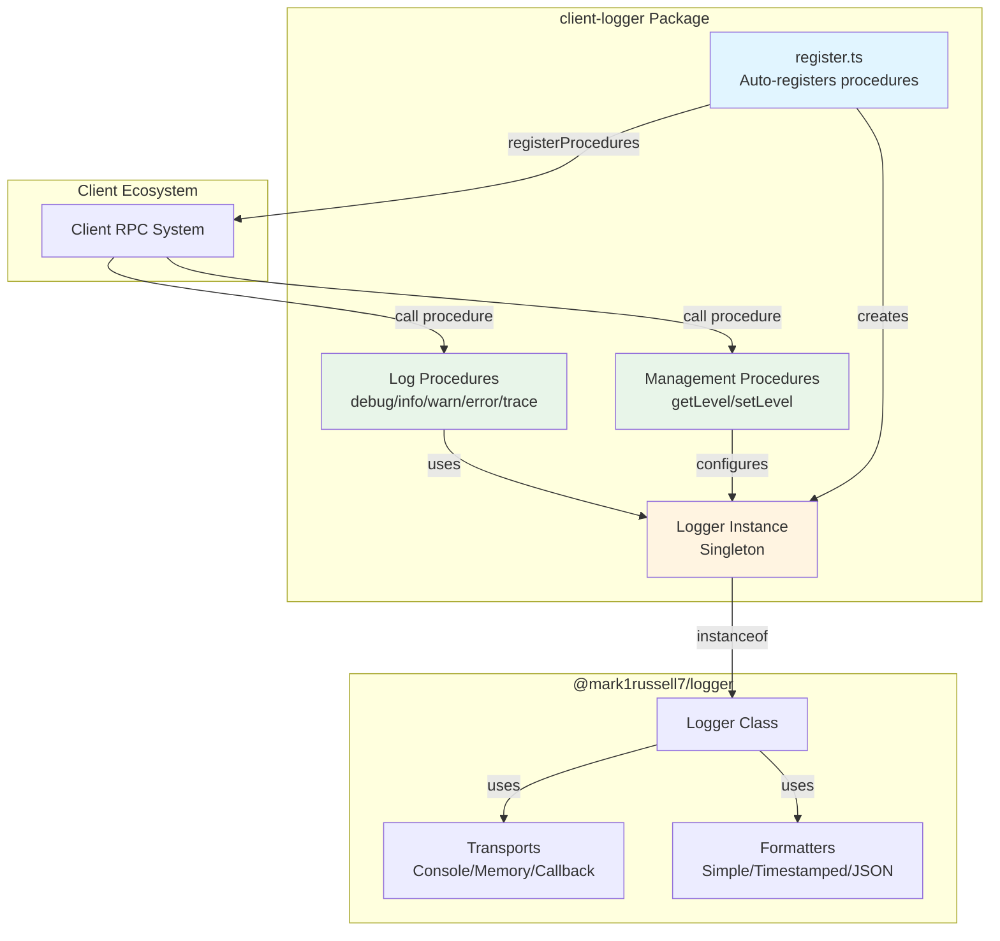
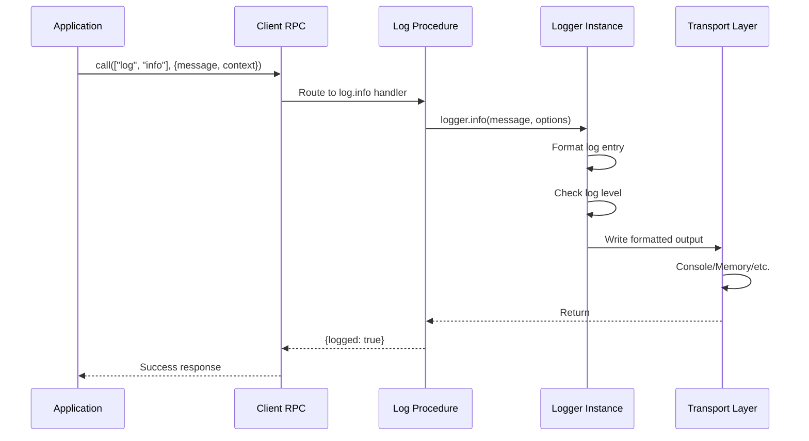
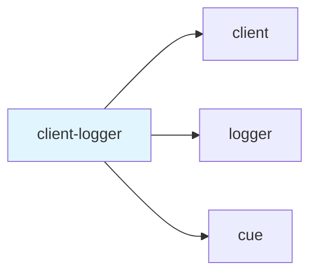

# @mark1russell7/client-logger

[](https://www.npmjs.com/package/@mark1russell7/client-logger)
[](https://opensource.org/licenses/MIT)

Bridge between client procedures and logger - logging via `client.call()`.

## Overview

`client-logger` exposes the `@mark1russell7/logger` package as callable client procedures. This enables structured logging through the client RPC interface, making it easy to integrate logging into any procedure-based workflow.

### Key Features

- **RPC-based Logging**: Log via `client.call(["log", "info"], {...})`
- **Multiple Log Levels**: DEBUG, TRACE, INFO, WARN, ERROR
- **Structured Logging**: Context, data, and error support
- **Runtime Configuration**: Get/set log levels dynamically
- **Auto-registration**: Procedures register on import
- **Full Logger Integration**: Re-exports all logger classes and utilities

## Architecture



### Data Flow



## Installation

```bash
npm install @mark1russell7/client-logger
```

### Dependencies

- `@mark1russell7/client` - Client RPC system
- `@mark1russell7/logger` - Core logging implementation
- `@mark1russell7/cue` - Build system

## Usage

### Basic Logging

```typescript
import { Client } from "@mark1russell7/client";

const client = new Client();

// Log at different levels
await client.call(["log", "debug"], {
  message: "Debugging info",
  context: "auth"
});

await client.call(["log", "info"], {
  message: "User logged in",
  context: "auth",
  data: { userId: "123" }
});

await client.call(["log", "warn"], {
  message: "API rate limit approaching",
  context: "api"
});

await client.call(["log", "error"], {
  message: "Request failed",
  context: "api",
  error: {
    name: "RequestError",
    message: "Connection timeout",
    stack: "..."
  }
});

await client.call(["log", "trace"], {
  message: "Detailed trace info",
  data: { requestId: "abc-123" }
});
```

### Managing Log Levels

```typescript
// Get current log level
const { level, levelName } = await client.call(["log", "getLevel"], undefined);
console.log(`Current level: ${levelName} (${level})`);
// Output: Current level: INFO (2)

// Set log level
import { LogLevel } from "@mark1russell7/client-logger";

await client.call(["log", "setLevel"], { level: LogLevel.DEBUG });
```

### Custom Logger Configuration

You can replace the default logger instance with a custom configuration:

```typescript
import {
  setLogger,
  createLogger,
  LogLevel,
  createJsonFormatter,
  createMemoryTransport
} from "@mark1russell7/client-logger";

// Create custom logger
const customLogger = createLogger({
  level: LogLevel.DEBUG,
  context: "my-app",
  formatter: createJsonFormatter(),
  transports: [createMemoryTransport()]
});

// Replace the default logger
setLogger(customLogger);

// Now all client.call(["log", ...]) will use your custom logger
```

### Direct Logger Access

You can also access the logger instance directly:

```typescript
import { getLogger } from "@mark1russell7/client-logger";

const logger = getLogger();
logger.info("Direct logging", { context: "app" });
```

## API Reference

### Procedures

All procedures are automatically registered when the package is imported.

#### `log.debug`

Log a message at DEBUG level.

**Input:**
```typescript
{
  message: string;          // Log message
  context?: string;         // Optional context/namespace
  data?: Record<string, unknown>;  // Optional structured data
  error?: {                 // Optional error object
    name: string;
    message: string;
    stack?: string;
  };
}
```

**Output:**
```typescript
{
  logged: boolean;  // Always true if no exception
}
```

#### `log.info`

Log a message at INFO level. Same signature as `log.debug`.

#### `log.warn`

Log a message at WARN level. Same signature as `log.debug`.

#### `log.error`

Log a message at ERROR level. Same signature as `log.debug`.

#### `log.trace`

Log a message at TRACE level. Same signature as `log.debug`.

#### `log.setLevel`

Set the current log level.

**Input:**
```typescript
{
  level: LogLevel;  // 0=TRACE, 1=DEBUG, 2=INFO, 3=WARN, 4=ERROR
}
```

**Output:**
```typescript
{
  logged: boolean;
}
```

#### `log.getLevel`

Get the current log level.

**Input:** `undefined`

**Output:**
```typescript
{
  level: LogLevel;      // Numeric level (0-4)
  levelName: string;    // Human-readable name (TRACE, DEBUG, etc.)
}
```

### Types

#### `LogLevel`

Enumeration of log levels:

```typescript
enum LogLevel {
  TRACE = 0,
  DEBUG = 1,
  INFO = 2,
  WARN = 3,
  ERROR = 4,
}
```

#### `LOG_LEVEL_NAMES`

Array mapping log levels to names:

```typescript
const LOG_LEVEL_NAMES: string[] = ["TRACE", "DEBUG", "INFO", "WARN", "ERROR"];
```

#### `LogEntry`

Structure of a log entry:

```typescript
interface LogEntry {
  timestamp: Date;
  level: LogLevel;
  levelName: string;
  message: string;
  context?: string;
  data?: Record<string, unknown>;
  error?: Error;
}
```

#### `LogOptions`

Options for logging methods:

```typescript
interface LogOptions {
  context?: string;
  data?: Record<string, unknown>;
  error?: Error;
}
```

#### `LoggerOptions`

Options for creating a logger:

```typescript
interface LoggerOptions {
  level?: LogLevel;
  context?: string;
  formatter?: Formatter;
  transports?: Transport[];
}
```

### Functions

#### `getLogger(): Logger`

Get the current logger instance.

#### `setLogger(newLogger: Logger): void`

Replace the current logger instance.

#### `registerLogProcedures(): void`

Register all log procedures with the client system. Called automatically on import.

#### `parseLogLevel(level: string | number): LogLevel`

Parse a log level from string or number.

```typescript
parseLogLevel("INFO");    // LogLevel.INFO
parseLogLevel(2);         // LogLevel.INFO
parseLogLevel("debug");   // LogLevel.DEBUG (case-insensitive)
```

### Re-exported Logger Classes

The package re-exports all classes and utilities from `@mark1russell7/logger`:

#### Logger Creation

- `createLogger(options?: LoggerOptions): Logger` - Create a new logger
- `Logger` - Logger class

#### Formatters

- `SimpleFormatter` - Basic text formatting
- `TimestampedFormatter` - Adds timestamps
- `JsonFormatter` - JSON output
- `createSimpleFormatter()` - Factory function
- `createTimestampedFormatter()` - Factory function
- `createJsonFormatter()` - Factory function

#### Transports

- `ConsoleTransport` - Logs to console
- `MemoryTransport` - Stores logs in memory
- `CallbackTransport` - Custom callback handler
- `createConsoleTransport(options?: ConsoleTransportOptions)` - Factory
- `createMemoryTransport()` - Factory
- `createCallbackTransport(options: CallbackTransportOptions)` - Factory

#### Transport Options

```typescript
interface ConsoleTransportOptions {
  console?: Console;  // Custom console object
}

interface CallbackTransportOptions {
  callback: (entry: LogEntry) => void;  // Custom handler
}
```

## Configuration

The package auto-registers procedures on import via the `postinstall` script:

```bash
client announce
```

This is configured in `package.json`:

```json
{
  "client": {
    "procedures": "./dist/register.js"
  }
}
```

### Default Logger Settings

The default logger is configured as:

```typescript
{
  level: LogLevel.INFO,
  context: "client"
}
```

## Integration with Ecosystem

### Used By

- Any package that needs structured logging via client procedures
- Bundle packages that aggregate logging functionality
- CLI tools that want procedure-based logging

### Depends On



## Examples

### Example 1: Contextual Logging

```typescript
// Log with context to identify source
await client.call(["log", "info"], {
  message: "Processing user request",
  context: "request-handler",
  data: {
    method: "POST",
    path: "/api/users",
    userId: "user-123"
  }
});
```

### Example 2: Error Logging

```typescript
try {
  await riskyOperation();
} catch (error) {
  await client.call(["log", "error"], {
    message: "Operation failed",
    context: "operations",
    error: {
      name: error.name,
      message: error.message,
      stack: error.stack
    },
    data: {
      operationId: "op-456"
    }
  });
}
```

### Example 3: Debug Mode

```typescript
import { LogLevel } from "@mark1russell7/client-logger";

// Enable debug logging for development
if (process.env.NODE_ENV === "development") {
  await client.call(["log", "setLevel"], { level: LogLevel.DEBUG });
}

await client.call(["log", "debug"], {
  message: "Cache hit",
  context: "cache",
  data: { key: "user:123", ttl: 3600 }
});
```

### Example 4: Custom Transport

```typescript
import {
  setLogger,
  createLogger,
  createCallbackTransport
} from "@mark1russell7/client-logger";

// Send logs to external service
const externalTransport = createCallbackTransport({
  callback: async (entry) => {
    await fetch("https://logs.example.com/ingest", {
      method: "POST",
      headers: { "Content-Type": "application/json" },
      body: JSON.stringify(entry)
    });
  }
});

const logger = createLogger({
  transports: [externalTransport]
});

setLogger(logger);
```

### Example 5: Memory Transport for Testing

```typescript
import {
  createLogger,
  createMemoryTransport,
  setLogger
} from "@mark1russell7/client-logger";

// Capture logs for testing
const memoryTransport = createMemoryTransport();
const testLogger = createLogger({
  transports: [memoryTransport]
});

setLogger(testLogger);

// Run test
await client.call(["log", "info"], { message: "Test log" });

// Verify logs
const logs = memoryTransport.getEntries();
expect(logs).toHaveLength(1);
expect(logs[0].message).toBe("Test log");
```

## Package Structure

```
client-logger/
├── src/
│   ├── index.ts          # Main exports
│   ├── types.ts          # Type re-exports from logger
│   └── register.ts       # Procedure registration & logger instance
├── dist/                 # Compiled output
├── package.json
├── tsconfig.json
└── README.md
```

## Development

### Build

```bash
npm run build
```

### Type Check

```bash
npm run typecheck
```

### Clean

```bash
npm run clean
```

## License

MIT - Mark Russell

## Related Packages

- `@mark1russell7/logger` - Core logging implementation
- `@mark1russell7/client` - Client RPC system
- `@mark1russell7/client-shell` - Shell command execution procedures
- `@mark1russell7/client-cli` - CLI wrapper procedures
